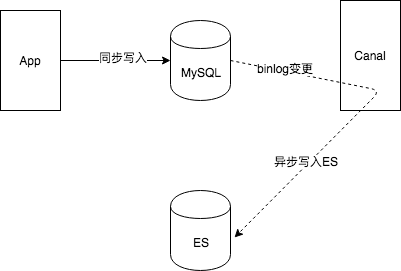

# 实战：多数据源同步

通常情况下，使用ES的地方一般都会使用MySQL，将MySQL作为数据源，ES作为前台搜索。写入一条数据到MySQL时，也需要同时写入ES中。此时写入ES就有两种方式：一种同步的方式，另一种异步的方式。写入MySQL后同步写入ES，好处是实时更新，插入成功即可搜索，缺点也很明显，事务的问题(MySQL成功，ES失败的情况应提供一种保障机制达到数据一致性)，性能的问题(一条数据需要同时插入MySQL和ES成功后才能返回结果)。另一种情况是在写入MySQL成功后，异步写入ES，优点是数据一致性问题比较容易保证，性能的问题也不必等待过久，缺点也很明显，插入MySQL成功后，由于异步的原因，并不能立刻从ES搜索出结果。

写入MySQL成功，即数据库中数据新增了一条数据，利用MySQL的```binlog```技术能监测到数据的变化，从而发送一条MQ写入到ES中。有关```binlog```可自行搜索。```Canal```即是[基于数据库增量日志解析，提供增量数据订阅和消费](https://github.com/alibaba/canal)的一款阿里巴巴开源软件。

在网络上已经有很多资料讲解如何通过```Canal```进行多数据源同步，这里不再给出详细的部署过程，下面是异步写入ES的架构图。



_Canal下载地址：[https://github.com/alibaba/canal/releases](https://github.com/alibaba/canal/releases)(下载deployer版本)。_

