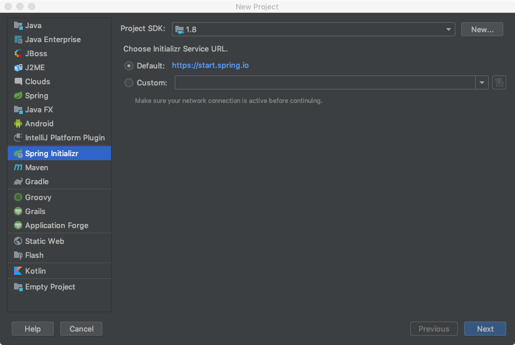
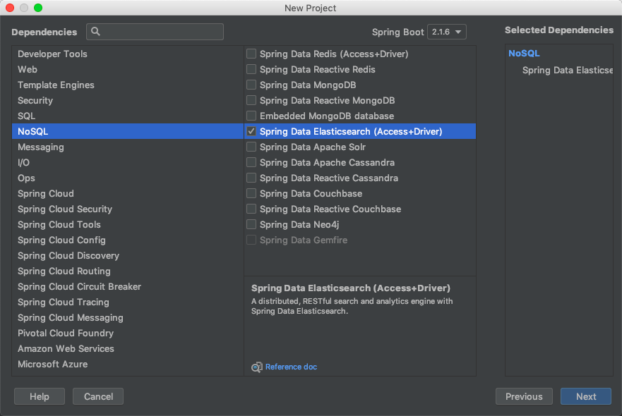

# Java客户端（上）

ES提供了多种方式使用Java客户端：

- TransportClient，通过Socket方式连接ES集群，传输会对Java进行序列化
- RestClient，通过HTTP方式请求ES集群

目前常用的是```TransportClient```方式连接ES服务。但ES官方表示，在未来```TransportClient```会被永久移除，只保留```RestClient```方式。

同样，Spring Boot官方也提供了操作ES的方式```Spring Data ElasticSearch```。本章节将首先介绍基于Spring Boot所构建的工程通过```Spring Data ElasticSearch```操作ES，再介绍同样是基于Spring Boot所构建的工程，但使用ES提供的```TransportClient```操作ES。

## Spring Data ElasticSearch

本节完整代码（配合源码使用更香）：[https://github.com/yu-linfeng/elasticsearch6.x_tutorial/tree/master/code/spring-data-elasticsearch](https://github.com/yu-linfeng/elasticsearch6.x_tutorial/tree/master/code/spring-data-elasticsearch)

使用```Spring Data ElasticSearch```后，你会发现一切变得如此简单。就连连接ES服务的类都不需要写，只需要配置一条ES服务在哪儿的信息就能**开箱即用**。

作为**简单的API和简单搜索**两章节的启下部分，本节示例仍然是**基于上一章节的示例**。

通过IDEA创建Spring Boot工程，并且在创建过程中选择```Spring Data ElasticSearch```，主要步骤如下图所示：

第一步，创建工程，选择```Spring Initializr```。



第二步，选择SpringBoot的依赖```NoSQL -> Spring Data ElasticSearch```。



创建好Spring Data ElasticSearch的Spring Boot工程后，按照ES惯例是定义Index以及Type和Mapping。在```Spring Data ElasticSearch```中定义Index、Type以及Mapping非常简单。ES文档数据实质上对应的是一个数据结构，也就是在```Spring Data ElasticSearch```要我们把ES中的文档数据模型与Java对象映射关联。

定义StudentPO对象，对象中定义Index以及Type，Mapping映射我们引入外部json文件（json格式的Mapping就是在**简单搜索**一章中定义的Mapping数据）。

```java
package com.coderbuff.es.easy.domain;

import lombok.Getter;
import lombok.Setter;
import lombok.ToString;
import org.springframework.data.annotation.Id;
import org.springframework.data.elasticsearch.annotations.Document;
import org.springframework.data.elasticsearch.annotations.Field;
import org.springframework.data.elasticsearch.annotations.FieldType;
import org.springframework.data.elasticsearch.annotations.Mapping;

import java.io.Serializable;

/**
 * ES mapping映射对应的PO
 * Created by OKevin on 2019-06-26 22:52
 */
@Getter
@Setter
@ToString
@Document(indexName = "user", type = "student")
@Mapping(mappingPath = "student_mapping.json")
public class StudentPO implements Serializable {

    private String id;

    /**
     * 姓名
     */
    private String name;

    /**
     * 年龄
     */
    private Integer age;
}
```

```Spring Data ElasticSearch```为我们屏蔽了操作ES太多的细节，以至于真的就是开箱即用，它操作ES主要是通过```ElasticsearchRepository```接口，我们在定义自己具体业务时，只需要继承它，扩展自己的方法。

```java
package com.coderbuff.es.easy.dao;

import com.coderbuff.es.easy.domain.StudentPO;
import org.springframework.data.elasticsearch.repository.ElasticsearchRepository;
import org.springframework.stereotype.Repository;

/**
 * Created by OKevin on 2019-06-26 23:45
 */
@Repository
public interface StudentRepository extends ElasticsearchRepository<StudentPO, String> {
}
```

```ElasticsearchTemplate```可以说是```Spring Data ElasticSearch```最为重要的一个类，它对ES的Java API进行了封装，创建索引等都离不开它。在Spring中要使用它，必然是要先**注入**，也就是实例化一个bean。而```Spring Data ElasticSearch```早为我们做好了一切，只需要在```application.properties```中定义```spring.data.elasticsearch.cluster-nodes=127.0.0.1:9300```，就可大功告成（网上有人的教程还在使用applicationContext.xml定义一个bean，事实证明，受到了Spring多年的“毒害”，Spring Boot远比我们想象的智能）。

单元测试创建Index、Type以及定义Mapping。

```java
package com.coderbuff.es;

import com.coderbuff.es.easy.domain.StudentPO;
import org.junit.Test;
import org.junit.runner.RunWith;
import org.springframework.beans.factory.annotation.Autowired;
import org.springframework.boot.test.context.SpringBootTest;
import org.springframework.data.elasticsearch.core.ElasticsearchTemplate;
import org.springframework.test.context.junit4.SpringRunner;

@RunWith(SpringRunner.class)
@SpringBootTest
public class SpringDataElasticsearchApplicationTests {

    @Autowired
    private ElasticsearchTemplate elasticsearchTemplate;

    /**
     * 测试创建Index，type和Mapping定义
     */
    @Test
    public void createIndex() {
        elasticsearchTemplate.createIndex(StudentPO.class);
        elasticsearchTemplate.putMapping(StudentPO.class);
    }
}
```

使用```GET http://localhost:9200/user```请求命令，可看到通过```Spring Data ElasticSearch```创建的索引。

索引创建完成后，接下来就是定义操作student文档数据的接口。在```StudentService```接口的实现中，通过组合```StudentRepository```类对ES进行操作。```StudentRepository```类继承了```ElasticsearchRepository```接口，这个接口的实现已经为我们提供了基本的数据操作，保存、修改、删除只是一句代码的事。就算查询、分页也为我们提供好了builder类。"最难"的实际上不是实现这些方法，而是如何构造查询参数```SearchQuery```。创建```SearchQuery```实例，有两种方式：

1. 构建```NativeSearchQueryBuilder```类，通过链式调用构造查询参数。
2. 构建```NativeSearchQuery```类，通过构造方法传入查询参数。

这里以"不分页range范围和term查询age>=21且age<26且name=kevin"为例。

```jave
SearchQuery searchQuery = new NativeSearchQueryBuilder()
                .withQuery(QueryBuilders.boolQuery()
                        .must(QueryBuilders.rangeQuery("age").gte(21).lt(26))
                        .must(QueryBuilders.termQuery("name", "kevin"))).build();
```

搜索条件的构造一定要对ES的查询结构有比较清晰的认识，如果是在了解了**简单的API**和**简单搜索**两章的前提下，学习如何构造多加练习一定能掌握。这里就不一一验证前面章节的示例，一定要配合代码使用练习(https://github.com/yu-linfeng/elasticsearch6.x_tutorial/tree/master/code/spring-data-elasticsearch)

## TransportClient

ES的Java API非常广泛，一种操作可能会有好几种写法。Spring Data ElasticSearch实际上是对ES Java API的再次封装，从使用上将更加简单。

本节请直接对照代码学习使用，如果要讲解ES的Java API那将是一个十分庞大的工作，[https://github.com/yu-linfeng/elasticsearch6.x_tutorial/tree/master/code/transportclient-elasticsearch](https://github.com/yu-linfeng/elasticsearch6.x_tutorial/tree/master/code/transportclient-elasticsearch)

